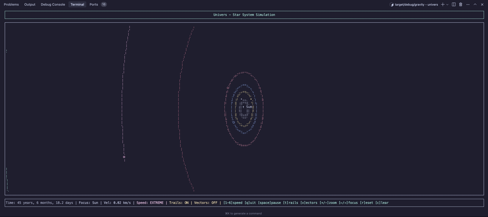

# Univers
=====================================================  

Unive.rs is a CLI tool to become a god and simulate your own star system. Built entirely in Rust, empowered by ratatui interface and GPU-accelerated linear algebra computations.

### Preview:


## Features

- 🌌 **Interactive Solar System Simulation**: Experience our solar system with accurate physics
- 🪐 **Realistic Orbital Mechanics**: Based on Newton's Law of Universal Gravitation
- ⏱️ **Time Control**: Speed up time to watch planetary motion over years in seconds
- 🎮 **Interactive Controls**: Navigate between planets, zoom in/out, toggle visual elements

## Terminal Interface

The simulation runs in your terminal using [ratatui](https://github.com/ratatui-org/ratatui), providing a rich interactive experience:

- View the orbits of all planets in our solar system
- Watch gravitational interactions between celestial bodies
- Focus on specific planets with detailed information panels
- Control the simulation speed from real-time to cosmic scale

## Controls

| Key | Action |
|-----|--------|
| Space | Pause/Resume simulation |
| 1-6 | Set simulation speed (1=slow, 6=cosmic) |
| +/- | Zoom in/out |
| Left/Right | Change focus to prev/next celestial body |
| i | Toggle detailed information panel |
| t | Toggle orbit trails |
| v | Toggle velocity vectors |
| r | Reset simulation |
| c | Clear trails |
| q | Quit |

## Gravity Engine
Gravity can be simulated in two ways: 
- **Newton's Law of Universal Gravitation**
- **Simplified Einstein's General Relativity.**
  
All mathematical approaches are stated in ./Mathematics.md.  
There are also several sidesteps for reducing computation complexity which are also stated there

### Status:
* **Ongoing** 🌊
* **Master Branch:** build successful 🚀

### Plans:
* 🤯 -> **Dynamic Gravity:** Manipulating gravity based on the CPU usage. If your CPU usage is high, the system will collapse and re-rendered again 💥
* 💥 -> **Collisions**
* 🕳️ -> **Black Holes**

### TODO List:
- [x] Implement codebase for celestial bodies and system
- [x] Implement a base physics engine
- [x] Implement a ratatui interactable interface
- [ ] Enhance physics with Simplified GR
- [ ] Implement collisions
- [ ] ... and many more!

## Build and Run
*Want to build and run Univers yourself? Here's how:*
```bash
git clone https://github.com/yourusername/univers.git
cd univers
cargo build --release && cargo run --release
```

## Future planning interface:

```
                                 SOLAR SYSTEM SIMULATION                                  
┌─────────────────────────────────────────────────────────────────────────────────────┐
│                                                              Mars                    │
│                                                              *                       │
│                              Earth                                                   │
│                               *                                                      │
│                                                                                      │
│                                                                      Jupiter         │
│                                                                       *              │
│                                                                                      │
│          Mercury                                                                     │
│            *                                                                         │
│                                                                                      │
│                                                                                      │
│                        Sun                                                           │
│                         *                                                            │
│                                                                                      │
│                                                                           Saturn     │
│                                                                            *         │
│                   Venus                                                              │
│                    *                                                                 │
│                                                                                      │
│                                                                                      │
└─────────────────────────────────────────────────────────────────────────────────────┘
┌─Information────────────────────────┐ ┌─Control────────────────────────────────────┐
│ Time Elapsed: 120.5 days           │ │ Space: Pause/Resume                        │
│ Focus: Earth                       │ │ 1-6: Set speed                             │
│ Position: (1.50e+11, 0.00e+00) m   │ │ +/-: Zoom in/out                          │
│ Velocity: (0.00e+00, 2.97e+04) m/s │ │ ←/→: Change focus                          │
└────────────────────────────────────┘ └────────────────────────────────────────────┘
```

## Current interface:

Feel free to contribute and build the universe with me! My contacts are in my profile.
